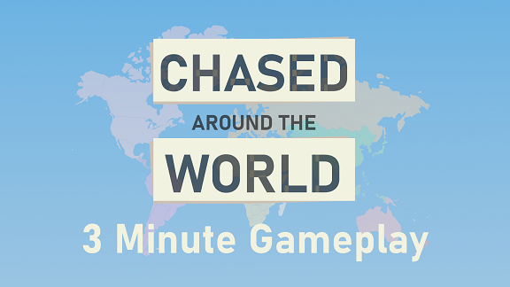

# Description
A small casual turn based game where you play as a thief collecting money bags or the police gathering clues to locate the thief.
At the same time, you can sharpen up your geography skills, learn where countries and it´s neighbors are located.

# Factsheet

## Developer
Sandwich Cake Studios 
One man indie company, based in sweden.

## Release Date
July 29th, 2022

## Platforms
Steam PC

## Regular Price
* USD 2.99
* EUR 2,39
* GBP 2.09
* (Launch Discount 30%)

# Features
* Short session game (15-25 minutes) For when you just want to pastime.
* 22 country cards, all presenting something famous for that country.
* Up to 140 countries to travel between.
* Improve your geography skills.
* Play as a thief or the police. Human, cat or dog.

# Videos
 

# Images
*You can download images from the Screenshots folder.* 

# Logos & Icon
*You can download logos from the Logos folder.* 

 

# Contact
[Discord](https://discord.com/invite/azWURcymGY) 
[Twitter](https://twitter.com/SandwichCakeStu)
